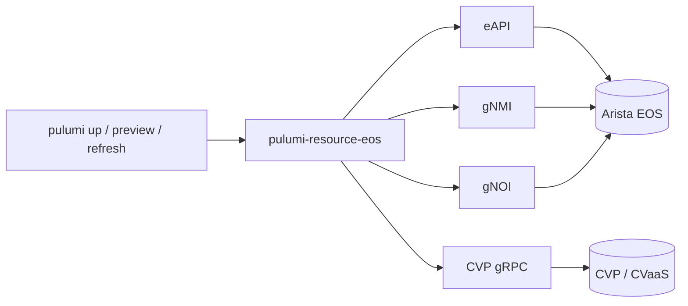

# pulumi-eos

<p align="center">
  <em>Native Go Pulumi resource provider for Arista EOS and CloudVision (CVP / CVaaS).</em>
</p>

<p align="center">
  <a href="https://github.com/dantte-lp/pulumi-eos/actions/workflows/ci.yml"></a>
  <a href="https://goreportcard.com/report/github.com/dantte-lp/pulumi-eos"></a>
  <a href="https://pkg.go.dev/github.com/dantte-lp/pulumi-eos"></a>
  <a href="https://github.com/dantte-lp/pulumi-eos/blob/main/LICENSE"></a>
  <a href="https://github.com/dantte-lp/pulumi-eos/releases"></a>
  <a href="https://api.securityscorecards.dev/projects/github.com/dantte-lp/pulumi-eos"></a>
</p>

## Overview

| Item | Value |
|---|---|
| Language | Go (provider) · Go / Python / TypeScript / .NET / Java (SDKs) |
| Targets | EOS 4.30+ · CVP 2024.x – 2026.1.x · CVaaS |
| Transports | eAPI · gNMI · gNOI · CloudVision Resource APIs |
| License | Apache-2.0 |
| Versioning | [SemVer 2.0.0](https://semver.org/spec/v2.0.0.html) |
| Commits | [Conventional Commits 1.0.0](https://www.conventionalcommits.org/en/v1.0.0/) |
| Changelog | [Keep a Changelog 1.1.0](https://keepachangelog.com/en/1.1.0/) |

## Architecture



## Status

| Phase | State |
|---|---|
| Requirements (S1) | active |
| Design (S2 – S3) | planned |
| Implementation (S4 – S9) | planned |
| Verification (S10 – S11) | planned |
| Deployment (S12) | planned |

See [`docs/02-implementation-plan.md`](docs/02-implementation-plan.md) for the full sprint plan.

## Quick start

### Install (post v1.0.0)

```bash
pulumi plugin install resource eos
```

### Build from source

```bash
make up        # start dev container (podman-compose)
make build     # build pulumi-resource-eos
make test      # run Go tests with race detector
make lint      # golangci-lint v2 (full set)
make lint-docs # markdownlint-cli2 + mermaid + yamllint + cspell
make sdks      # generate Go / Python / TypeScript / .NET / Java SDKs
```

## Documentation

| Topic | Path |
|---|---|
| Architecture | [`docs/01-architecture.md`](docs/01-architecture.md) |
| Implementation plan | [`docs/02-implementation-plan.md`](docs/02-implementation-plan.md) |
| Resource catalog | [`docs/03-resource-catalog.md`](docs/03-resource-catalog.md) |
| Provider configuration | [`docs/04-provider-config.md`](docs/04-provider-config.md) |
| Development | [`docs/05-development.md`](docs/05-development.md) |
| Testing | [`docs/06-testing.md`](docs/06-testing.md) |
| Release | [`docs/07-release.md`](docs/07-release.md) |
| Research references | [`docs/08-research-references.md`](docs/08-research-references.md) |

## License

Apache License 2.0 — see [`LICENSE`](LICENSE).
