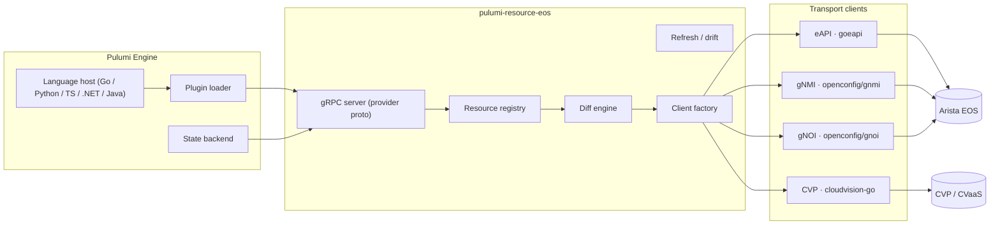
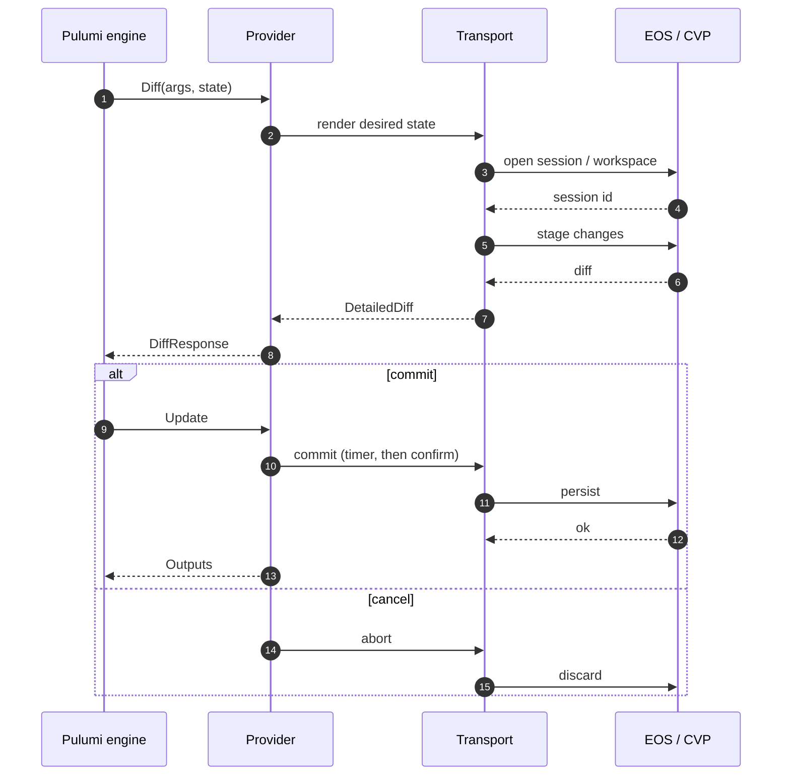
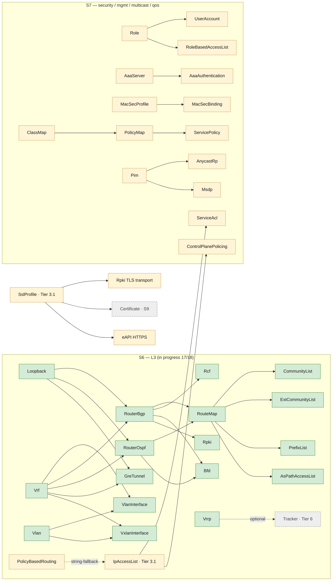

# Architecture

## Component diagram

## Transport selection matrix

| Resource family | Default transport | Fallback | Notes |
|---|---|---|---|
| `eos:device:Device` | eAPI | gNMI Get | Read-only facts. |
| `eos:device:Configlet` | eAPI · config session | — | Atomic apply; rollback on `commit timer` lapse. |
| `eos:device:RawCli` | eAPI · config session | — | Escape hatch for unmodeled features. |
| `eos:device:OsImage` | gNOI · `OS.Install` | eAPI software-install | Long-running; polled. |
| `eos:device:Reboot` | gNOI · `System.Reboot` | eAPI `reload` | Gated by Pulumi confirmation. |
| `eos:device:Certificate` | gNOI · `Cert.Rotate` | eAPI cert install | Hitless via gNSI when supported. |
| `eos:l2:*` | eAPI · config session | gNMI `union_replace` (EOS ≥ 4.35) | Drift via gNMI Subscribe. |
| `eos:l3:*` | eAPI · config session | gNMI `union_replace` (EOS ≥ 4.35) | Same as L2. |
| `eos:security:*` | eAPI · config session | — | AAA-sensitive; require explicit approval. |
| `eos:management:*` | eAPI | gNMI Get for read | Includes SSL profiles, NTP, DNS, logging. |
| `eos:cvp:*` | CVP gRPC (Resource APIs) | — | Bearer-token auth; Workspace + Change Control. |

## State model

| Aspect | Decision |
|---|---|
| Identity | Provider-assigned ID = `<area>/<name>/<host-or-org>`. |
| Drift detection | gNMI `Subscribe` on `last-configuration-timestamp`; on-demand `Get` per managed path during `Refresh`. |
| Idempotence | Same `Args` → no diff; CRUD ops MUST be safe to repeat. |
| Cancellation | Honour `context.Context` from Pulumi engine; abort active config session on cancel. |
| Secrets | Pulumi `Secret` types; never persisted unencrypted. |
| Retries | Exponential backoff with jitter; max 5 attempts; transient errors only. |

## Apply flow

## Authentication

| Plane | Mechanism |
|---|---|
| eAPI | Basic over HTTPS · optional mTLS via `management security ssl profile`. |
| gNMI / gNOI | TLS or mTLS · username via gRPC metadata · gNSI hitless cert rotation (EOS ≥ 4.31). |
| CVP / CVaaS | Service-account bearer token (`Authorization: Bearer …`) · 1-year max expiry · regional endpoints. |

## Resource-dependency graph (S6 / S7)

This graph captures the dependencies between Pulumi resources that
drive the **dependency-depth tier ordering** in
[`docs/STATUS.md` §Priority ordering](STATUS.md). Each edge `A → B`
means "B references A by name in its Args shape, so A must ship
first or B falls back to a string-typed reference."

**Key dependency observations** (drove the Tier 3 re-ordering):

- **`IpAccessList` is the single biggest unblocker** in S7 — it
  hardens the input string fallback in `PolicyBasedRouting` and
  closes the open `RouteMap.match ip address access-list` audit gap.
  Therefore Tier 3.1 ships it first.
- **`SslProfile` unblocks 3 separate features** (RPKI TLS, Certificate
  rotation in S9, eAPI HTTPS) — also Tier 3.1.
- **Pure dependency chains** (3.2 AAA, 3.3 sec-core, 3.6 QoS) ship
  _after_ their unblockers and serialise within the phase.
- **Independent campus / mgmt-extras / CVP** can ship in parallel
  with 3.x phases — they share no Pulumi resource graph edges with
  the security/AAA path.
