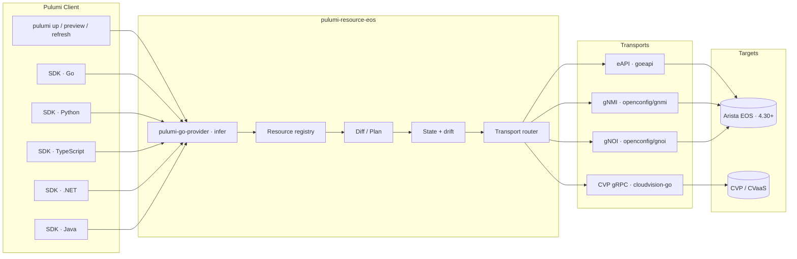
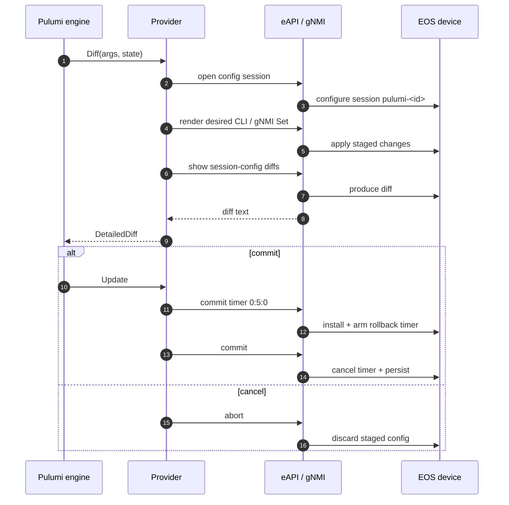

# Implementation Plan — `pulumi-eos`

- **Method:** Waterfall (phased, gated lifecycle).
- **Scope:** Native Go Pulumi resource provider for Arista EOS and Arista CloudVision (CVP / CVaaS).
- **Cadence:** 12 sprints × 2 weeks → ~24 weeks to `v1.0.0`, then maintenance.
- **Standards:** [Keep a Changelog 1.1.0], [Conventional Commits 1.0.0], [Semantic Versioning 2.0.0].

[Keep a Changelog 1.1.0]: https://keepachangelog.com/en/1.1.0/
[Conventional Commits 1.0.0]: https://www.conventionalcommits.org/en/v1.0.0/
[Semantic Versioning 2.0.0]: https://semver.org/spec/v2.0.0.html

---

## 1. Targets

| Plane | Surface | Transport | Library |
|---|---|---|---|
| On-box | EOS 4.30+ | eAPI · JSON-RPC over HTTPS | `aristanetworks/goeapi` |
| On-box | EOS 4.30+ | gNMI · gRPC/TLS · port 6030 | `openconfig/gnmi` + `openconfig/ygot` |
| On-box | EOS 4.30+ | gNOI · gRPC/TLS | `openconfig/gnoi` |
| Fleet | CVP 2024.x – 2026.1.x | Resource APIs · gRPC/TLS · bearer token | `aristanetworks/cloudvision-go` |
| Fleet | CVaaS | Resource APIs · gRPC/TLS · service-account token | `aristanetworks/cloudvision-go` |

## 2. Decisions

| ID | Decision | Rationale |
|---|---|---|
| ADR-1 | Native Go provider via `pulumi-go-provider` (infer). | Native diff/preview/rollback; idiomatic Go; broader scope than the CloudEOS-only Terraform provider. |
| ADR-2 | License: Apache-2.0. | Aligns with Arista libraries (`cloudvision-go`, `cloudvision-apis`, `eossdkrpc`, AVD) and Pulumi Registry. |
| ADR-3 | Discrete resources, not single-blob device config. | Pulumi's diff model is per-resource; AVD is design reference, not auto-source. |
| ADR-4 | Atomic apply via EOS config sessions + `commit timer`; gNMI `union_replace` (4.35.0F+). | Confirmed-commit, auto-rollback, deterministic diff. |
| ADR-5 | Repository layout: `golang-standards/project-layout` (matches `gobfd`). | Familiar; reuses tooling. |
| ADR-6 | Build / test / lint / release: Podman + podman-compose; automation: `podman-py`. | No host Go toolchain required; reproducible. |
| ADR-7 | golangci-lint allowlist (`default: none`). | Explicit, severity-tiered, auditable. |
| ADR-8 | Documentation: English, declarative, Mermaid-rendered, lint-gated. | Single style; CI-enforced. |

## 3. Architecture



### 3.1 Layers

| Layer | Path | Responsibility |
|---|---|---|
| Entrypoint | `cmd/pulumi-resource-eos` | `infer.NewProviderBuilder()` wiring; gRPC server. |
| Provider | `internal/provider` | Provider config, secret handling, client factories. |
| Resources | `internal/resources/<area>` | One package per resource family; CRUD + Diff. |
| eAPI client | `internal/client/eapi` | `goeapi` wrapper; config sessions; `commit timer`. |
| gNMI client | `internal/client/gnmi` | OpenConfig + `cli`-origin Set; `union_replace`. |
| gNOI client | `internal/client/gnoi` | `OS.Install`, `System.Reboot`, `Cert.Rotate`. |
| CVP client | `internal/client/cvp` | Bearer-token auth; per-service helpers. |
| Schema | `internal/schema` | AVD `eos_cli_config_gen` fragment ingestion. |
| Public types | `pkg/eos` | Stable types re-exported for SDK consumers. |

### 3.2 Resources (initial coverage)

Aligned with the [EOS Supported Features Matrix 4.35.0F](https://www.arista.com/en/support/product-documentation/supported-features). Detailed shape per resource lives in `docs/03-resource-catalog.md`.

| Module | Resources |
|---|---|
| `eos:device` | `Device`, `Configlet`, `RawCli`, `OsImage`, `Reboot`, `Certificate` |
| `eos:l2` | `Vlan`, `VlanRange`, `VlanInterface`, `Interface`, `PortChannel`, `EvpnEthernetSegment`, `Mlag`, `VxlanInterface`, `MacAddressTable`, `Varp`, `Stp`, `Dot1x`, `Mab`, `Pvlan`, `Cfm`, `StormControl` |
| `eos:l3` | `Loopback`, `Vrf`, `Subinterface`, `StaticRoute`, `RouterBgp`, `RouterOspf`, `RouterIsis`, `Bfd`, `PrefixList`, `RouteMap`, `CommunityList`, `ExtCommunityList`, `AsPathAccessList`, `Rcf`, `Rpki`, `GreTunnel`, `Vrrp`, `PolicyBasedRouting`, `Nat`, `ResilientEcmp` |
| `eos:multicast` | `Igmp`, `IgmpSnooping`, `Pim`, `AnycastRp`, `Msdp`, `MulticastRoutingTable` |
| `eos:security` | `IpAccessList`, `Ipv6AccessList`, `MacAccessList`, `RoleBasedAccessList`, `UserAccount`, `Role`, `AaaServer`, `AaaAuthentication`, `SslProfile`, `MacSecProfile`, `MacSecBinding`, `ControlPlanePolicing`, `Urpf`, `DhcpRelay`, `DhcpSnooping`, `DynamicArpInspection`, `IpSourceGuard`, `ServiceAcl`, `ArpRateLimit` |
| `eos:qos` | `ClassMap`, `PolicyMap`, `ServicePolicy`, `QosMap`, `PriorityFlowControl`, `BufferProfile` |
| `eos:management` | `ManagementInterface`, `Hostname`, `NtpServer`, `DnsServer`, `Logging`, `Snmp`, `Sflow`, `Telemetry`, `EApi`, `EventMonitor`, `PortMirror` |
| `eos:cvp` | `Workspace`, `Studio`, `Configlet`, `ChangeControl`, `Tag`, `Device`, `Inventory`, `ServiceAccount`, `IdentityProvider`, `ImageBundle`, `Compliance`, `Alert` |

### 3.3 Apply flow



## 4. Quality gates

| Gate | Tool | Trigger |
|---|---|---|
| Go static analysis (83 linters) | `golangci-lint v2.11.4` (allowlist, severity-tiered) | `make lint` · CI |
| SAST | `gosec` embedded in golangci-lint (`severity: low`, `confidence: low`, audit-mode); `semgrep p/golang` host-side | `make lint` (gosec) · `make semgrep` · CI |
| Vulnerability | `govulncheck v1.2.0` + `osv-scanner v2.3.5` (allowlist) | `make vulncheck` · CI |
| Container scan | `trivy` (CRITICAL/HIGH) | CI |
| Markdown | `markdownlint-cli2` | `make lint-md` · CI |
| Mermaid | `@mermaid-js/mermaid-cli` (parse-only render) | `make lint-mmd` · CI |
| YAML | `yamllint` | `make lint-yaml` · CI |
| Spelling | `cspell` | `make lint-spell` · CI |
| Commits | `commitlint @commitlint/config-conventional` | pre-commit · PR-title CI |
| SBOM | `syft` | release |
| Supply chain | OpenSSF Scorecard, CodeQL Go, Dependabot | scheduled |
| Tests | `gotestsum` + `junit2html` | `make test-report` · CI |
| Pre-commit gate | `make verify` (= `all` + `test-integration-keep`) | every resource-touching commit per `docs/05-development.md` "Mandatory per-resource verification rules" |
| Live cEOS round-trip | `make test-integration-keep` (eAPI + gNMI Capabilities against cEOS 4.36.0.1F) | inside `make verify`; CI runs the full bring-up/tear-down `test-integration` variant |

Severity → `error`: `gosec`, `errcheck`, `bodyclose`, `noctx`, `staticcheck`, `forcetypeassert`, `containedctx`, `nilnil`, `reassign`, `forbidigo`, `gomodguard`, `iotamixing`, `paralleltest`. All others → `warning`. No merge with unresolved `error`-tier findings.

## 5. Sprints

### Phase 1 — Requirements

| # | Output | Exit |
|---|---|---|
| **S1** | SRS, risk register, scope, success metrics. | SRS approved; v0.x resource list frozen; KPIs agreed. |

### Phase 2 — Design

| # | Output | Exit |
|---|---|---|
| **S2** | Component diagram, sequence diagrams (CRUD/Refresh/Cancel), transport matrix, error taxonomy, retry/backoff policy. | Design doc approved; transport assigned per resource. |
| **S3** | Pulumi schema draft (`schema.json`), `Args`/`State` structs, dependency graph, AVD-fragment-to-resource mapping, public-API freeze for v0.1.0. | `pulumi package validate` passes; ADRs 1-8 frozen. |

### Phase 3 — Implementation

| # | Scope | Exit |
|---|---|---|
| **S4** | Repo bootstrap, `cmd/pulumi-resource-eos`, provider config, eAPI client, CVP client, cEOS integration test stack, CI green, release dry-run; `eos:device:Configlet` (atomic raw CLI block via config-session). | `pulumi up` against cEOS lab works; `v0.1.0-rc.1` tagged. **Done — commits f6ae43f → 98daa9c plus Configlet (`be4d732`).** |
| **S5** | L2 core: `Vlan`, `VlanRange`, `VlanInterface`, `Interface`, `PortChannel`, `EvpnEthernetSegment`, `Mlag`, `VxlanInterface`, `MacAddressTable`, `Varp`, `Stp`; `RawCli` escape; minimum gNMI client. | All L2 resources pass unit + integration; SDK gen-sdk produces 5 SDKs. **Implementation done — shipped: `Vlan` (`fa20b40`), `VlanInterface` (`2a77f2e`), `Interface` (`449ea8e`), `PortChannel` + shared `SwitchportFields` (`b516f28`), `VxlanInterface` (`193a4e6`), `EvpnEthernetSegment` (`09dd4f1`), `Mlag` (`b3e2c5d`), `Stp` (`2a64a58`), `Varp` (`726b26c`), `VlanRange` (`5fa01a1`), `RawCli` (`f4adb59`), `MacAddressTable` (`fb0be36`), minimum gNMI client (`363f31e`); 16/16 cEOS integration tests pass.** RC-readiness pending: `schema.json` via `bin/pulumi-resource-eos -schema`, `pulumi package gen-sdk` × 5 (Go / Python / TypeScript / .NET / Java), `v0.1.0-rc.1` tag. |
| **S6** | L3 family: `Loopback`, `Vrf`, `Bfd`, `Subinterface`, `StaticRoute`, `RouterBgp` (peer-groups, per-AF, per-VRF, RD/RT, RCF), `RouterOspf`, `PrefixList`, `RouteMap`, `CommunityList`, `ExtCommunityList`, `AsPathAccessList`, `Rcf`, `Rpki`, `GreTunnel`, `Vrrp`, `ResilientEcmp`, `PolicyBasedRouting`. | Leaf-spine demo (2 leaves + 1 spine, EVPN A-A) deploys end-to-end against cEOS. **In progress (17/18) — shipped: `Loopback` (`5dcc4df`), `Vrf` (`c335d22`), `Bfd` (`eea0e74`), `Subinterface` (`8b2dd6e`), `StaticRoute` (`908af76`), `RouterBgp` v0 (`1574102`), `PrefixList` (`11a4cd6`), `RouteMap` (`d50fc2a` + additive-flag fix `72c7db5` + `Match.Origin` removal `8d7ea48`), `CommunityList` (`1566544`), `ExtCommunityList` (`51416dc`), `AsPathAccessList` (`888a110`), `Rcf` v1 (`8e02a46`, supersedes v0 `fbdfbb5`), `Rpki` (`1e93356` + `transport ssh` → `tls` correction), `RouterOspf` v0 (`a059ec1`), `GreTunnel` v0 (`d2ee58a` + `mpls-*` mode removal `8d7ea48`), `Vrrp` v0 (`9d28327`), `ResilientEcmp` v0 (`e6606fe`, platform-only — TOI 13938); 33/33 cEOS integration tests pass. Cross-resource keyword audit (`make probe-audit`) at 93/94 surface lines accepted across 13 surfaces. Remaining: `PolicyBasedRouting` (last in dependency order — takes ACL name as a string).** |
| **S7** | Security & management & multicast: `IpAccessList`, `Ipv6AccessList`, `MacAccessList`, `RoleBasedAccessList`, `UserAccount`, `Role`, `AaaServer`, `AaaAuthentication`, `SslProfile`, `MacSecProfile`, `MacSecBinding`, `ControlPlanePolicing`, `Urpf`, `DhcpRelay`, `DhcpSnooping`, `DynamicArpInspection`, `IpSourceGuard`, `ServiceAcl`, `ArpRateLimit`, `Dot1x`, `Mab`, `Pvlan`, `StormControl`, `Igmp`, `IgmpSnooping`, `Pim`, `AnycastRp`, `Msdp`, all `eos:management:*`, all `eos:qos:*`. | Management, security, multicast, QoS planes covered; AAA / RBAC documented. |
| **S8** | CloudVision: `Workspace`, `Studio`, `Configlet`, `ChangeControl`, `Tag`, `Device`, `Inventory`, `ServiceAccount`, `IdentityProvider`, `ImageBundle`, `Compliance`, `Alert`. | CVP demo: import fabric → roll change via Workspace + Change Control. |
| **S9** | Day-2 / gNOI / drift: `OsImage`, `Reboot`, `Certificate`; gNMI `Subscribe(last-configuration-timestamp)` drift; `pulumi refresh` accuracy report. | Day-2 covered; refresh diff ≡ `show running-config` diff under randomized perturbation. |

### Phase 4 — Verification

| # | Scope | Exit |
|---|---|---|
| **S10** | Matrix: cEOS 4.30 / 4.32 / 4.34 / 4.36; CVP 2024.3 / 2025.3 / 2026.1; CVaaS prod region. 24 h soak. Negative tests (network partition, expired token, mid-apply cancel). | Matrix cells green; soak recovers from injected faults; P95 < 30 s per CRUD. |
| **S11** | UAT (2 reference users); Pulumi Registry submission; user manual; examples in Go / Python / TypeScript / .NET / Java. | UAT signed off; Registry intake accepted; docs lint-clean. Tag `v1.0.0-rc.1`. |

### Phase 5 — Deployment

| # | Scope | Exit |
|---|---|---|
| **S12** | `v1.0.0`. SDKs to npm / PyPI / NuGet / Maven Central. Provider binary on GitHub Releases (linux/darwin/windows × amd64/arm64) + SBOM + checksums + cosign. Container image to `ghcr.io/dantte-lp/pulumi-eos`. | `pulumi plugin install resource eos v1.0.0` succeeds; Pulumi Registry listed. |

### Phase 6 — Maintenance

| Cadence | Action |
|---|---|
| 2 weeks | Patch (`v1.0.x`). |
| 8 weeks | Minor (`v1.x.0`). |
| On schema break | Major (`vN.0.0`). |
| Per Arista quarterly release | Re-run matrix; update compatibility table. |
| Weekly | Dependabot. |
| 7 days SLA | CRITICAL CVE patch. |

## 6. Risk register (top 10)

| ID | Risk | L | I | Mitigation |
|---|---|---|---|---|
| R1 | `pulumi-go-provider` API churn pre-v1. | M | M | Pin minor; vendor shims for breaking changes. |
| R2 | gNMI `union_replace` unavailable on EOS < 4.35. | H | M | Default to eAPI config-sessions; gate gNMI features on EOS version. |
| R3 | AVD metaschema is non-standard JSON Schema. | H | L | Treat AVD as design reference; curate by hand. |
| R4 | CVaaS rate-limits / token expiry. | M | M | Backoff + jitter; surface token-expiry warnings. |
| R5 | CVP API drifts faster than `cloudvision-go`. | L | M | Pin minor; weekly regression `buf generate` against `cloudvision-apis`. |
| R6 | Compatibility expectations vs `terraform-provider-cloudeos`. | L | L | Document explicit non-goal; provide migration cookbook in v1.1. |
| R7 | Pulumi Registry licensing constraints. | L | H | Confirm pre-`v1.0`. |
| R8 | Long-running ops trip Pulumi engine timeouts. | M | M | `infer.Logger` progress; per-op timeout overrides. |
| R9 | CVP creds in CI. | M | M | Ephemeral service-account tokens; mock CVP in CI. |
| R10 | Lab availability for matrix. | M | L | cEOS via Containerlab on Podman runtime. |

## 7. Definition of done (per resource)

1. `Args` / `State` structs annotated.
2. `Create` / `Read` / `Update` / `Delete` / `Diff` implemented.
3. `Diff` returns `DetailedDiff`; `DryRun` honoured.
4. ≥ 5 unit edge cases (empty, max-length identifier, idempotent re-create, conflict, network error).
5. Integration test against cEOS or mocked CVP, green in CI.
6. Idempotency: same `Args` twice → no diff.
7. Drift: hand-edit on device → `pulumi refresh` reports the drift.
8. Resource doc page generated under `docs/resource-catalog/<area>/<name>.md`.
9. Schema entry passes `pulumi package validate`.
10. SDK code-gen succeeds for Go / Python / TypeScript / .NET / Java.

## 8. Repository layout

```text
pulumi-eos/
├── cmd/
│   └── pulumi-resource-eos/      # provider binary
├── internal/
│   ├── provider/                 # infer wiring + config + secrets
│   ├── resources/{device,l2,l3,security,management,cvp}/
│   ├── client/{eapi,gnmi,gnoi,cvp}/
│   ├── schema/                   # AVD fragment ingestion
│   └── version/                  # ldflags-injected
├── pkg/eos/                      # public stable types
├── api/                          # OpenAPI / proto if applicable
├── schemas/                      # Pulumi schema artifacts
├── examples/{go,python,typescript,dotnet,java}/
├── docs/
├── deployments/
│   ├── docker/                   # Containerfile.{dev,release}
│   └── compose/                  # compose.dev.yml + integration stacks
├── scripts/
│   ├── automation/               # podman-py automation
│   ├── vuln-audit.go
│   └── lint-docs.sh
├── test/{unit,integration,matrix}/
├── testdata/
├── reports/
├── .github/workflows/
├── .golangci.yml
├── .markdownlint-cli2.yaml
├── .commitlintrc.yaml
├── .yamllint.yaml
├── .cspell.json
├── .editorconfig
├── .gitattributes
├── .pre-commit-config.yaml
├── Makefile
├── go.mod / go.sum
├── CHANGELOG.md / CONTRIBUTING.md / SECURITY.md / LICENSE / README.md
```

## 9. Tooling versions (frozen at Phase 3 entry)

| Tool | Version |
|---|---|
| Go | `1.26.2` (`golang:1.26.2-trixie`) |
| Pulumi CLI | `>= 3.130.0` |
| `pulumi-go-provider` | `>= 0.30.0` |
| `pulumi/sdk/v3` | `>= 3.130.0` |
| `aristanetworks/goeapi` | latest tag |
| `aristanetworks/cloudvision-go` | pinned to HEAD ± 1 week |
| `openconfig/{gnmi,gnoi,ygot,goyang}` | latest tags |
| `golangci-lint` | `v2.11.4` |
| `govulncheck` | `v1.2.0` |
| `osv-scanner` | `v2.3.5` |
| `markdownlint-cli2` | latest |
| `@mermaid-js/mermaid-cli` | latest |
| `yamllint`, `cspell`, `commitlint` | latest |
| `podman` | `>= 5.0` |
| `podman-compose` | `>= 1.5` |
| `podman-py` | `>= 5.0` |

## 10. Branching, releases, commits

- **Trunk-based.** `main` always shippable.
- **Branches:** `feat/<area>/<name>`, `fix/<area>/<name>`, `chore/<area>/<name>`. Squash-merge.
- **Conventional Commits 1.0.0:** `feat | fix | chore | docs | build | ci | refactor | perf | test | style | revert`. Scope = top-level area. Enforced by commitlint.
- **SemVer 2.0.0:** provider binary, JSON schema, and SDKs share one version.
- **Tags:** `vX.Y.Z`, annotated, GPG-signed.
- **Changelog:** Keep a Changelog 1.1.0; on release, awk-extract section between two `## [` headers and feed `goreleaser --release-notes`.

## 11. Out of scope (v1.0)

- AVD `eos_designs` (intent layer) port → candidate for v2.x.
- cEOS / vEOS image building.
- TerminAttr ingest analytics (drift signals only).
- NETCONF / RESTCONF transport (deferred).

## 12. Acceptance criteria for `v1.0.0`

- All Phase-3 resources meet definition of done.
- All Phase-4 matrix cells green.
- Pulumi Registry listing live.
- SDKs published to npm / PyPI / NuGet / Maven Central.
- Release notes match `CHANGELOG.md` `[1.0.0]`.
- SBOM, checksums, cosign signatures attached.
- Reference CI templates available under `examples/ci/`.
