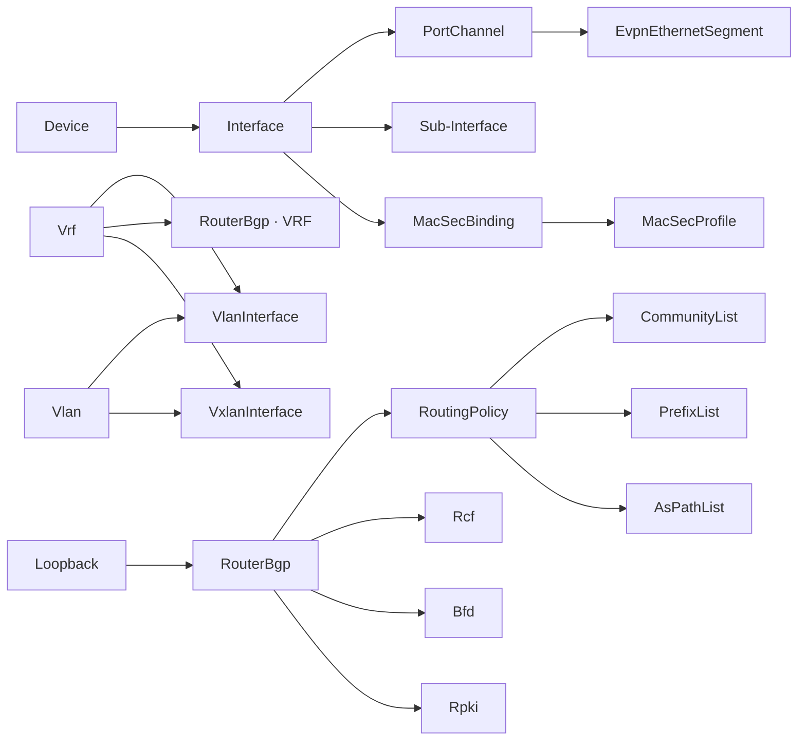

# Resource catalog

> Initial v0.x resource set, expanded to cover the EOS surface required by a
> production EVPN/VXLAN multi-site fabric. Per-resource design pages under
> `docs/resource-catalog/<area>/<name>.md` are generated from the Pulumi
> schema in S3.

Sources:

- Field-shape requirements derived from `/opt/projects/repositories/um-docs/docs/infrastructure/`
  (P-04 ASN, P-05 VLAN/VNI/RT, P-06 naming, P-08 EVPN/VXLAN, P-09 underlay,
  P-10 overlay, P-11 ESI, P-12 QoS, P-13 border, P-14 firewall insertion,
  P-15 H-fabric, P-22 BGP policy, P-26 DCI, P-27 BRT BGP).
- Feature confirmation via `arista-mcp` against the EOS 4.30+ corpus.

## `eos:device`

| Resource | Transport | Sprint | Notes |
|---|---|---|---|
| `Device` | eAPI · `show version` / gNMI Get | S4 | Read-only handle; surfaces model, serial, EOS version, system MAC. |
| `Configlet` | eAPI · config session | S4 | File-style raw block; commit timer + abort lifecycle. |
| `RawCli` | eAPI · config session | S5 | Escape hatch for unmodeled features; idempotent via Diff between desired and `show running-config`. |
| `OsImage` | gNOI `OS.Install` (4.24.2F+) · poll `OS.Verify` | S9 | Long-running; progress streamed via `infer.Logger`. |
| `Reboot` | gNOI `System.Reboot` (4.27.0F+) | S9 | Gated by Pulumi confirmation; supports cancel. |
| `Certificate` | gNOI `Cert.Rotate` · gNSI hitless (4.31.0F+) | S9 | mTLS rotation without session loss. |

## `eos:l2`

| Resource | Transport | Sprint | Key fields |
|---|---|---|---|
| `Vlan` | eAPI · config session | S5 | `id`, `name`, optional L2-VNI binding, `mac learning`. |
| `VlanRange` | eAPI · config session | S5 | bulk allocation; matches plan ranges (e.g. 100-199 service-chain, 800-1999 prod). |
| `VlanInterface` (SVI) | eAPI · config session | S5 | `vlan_id`, `vrf`, `ip address virtual`, `mtu` (≥9000), description, `no autostate`. |
| `Interface` | eAPI · config session | S5 | switchport mode (`access` / `trunk` / `routed`), allowed-VLAN list, native VLAN, `mtu`, description, lldp tx/rx, sflow enable, channel-group active mode. |
| `PortChannel` | eAPI · config session | S5 | `Port-Channel<n>`, members, lacp system-id, mlag id (optional), evpn ethernet-segment block. |
| `EvpnEthernetSegment` | eAPI · config session | S5 | `identifier auto\|<10byte>`, `redundancy all-active\|single-active\|port-active`, `route-target import auto\|<6byte>`, `df-election algorithm modulus\|hrw\|preference`. |
| `Mlag` | eAPI · config session | S5 | peer-link, peer-address-heartbeat, dual-primary detection, ISSU. Optional in EVPN A-A designs. |
| `VxlanInterface` | eAPI · config session | S5 | `Vxlan1`, `vxlan source-interface Loopback1`, `vxlan udp-port 4789`, `vxlan vlan {id} vni {vni}`, `vxlan vrf {vrf} vni {l3vni}`, optional `vxlan qos dscp propagation encapsulation`. |
| `MacAddressTable` | eAPI · `show mac address-table` | S5 | Read-only data source. |
| `Varp` | eAPI · config session | S5 | Global `ip virtual-router mac-address H.H.H` per fabric. |
| `Stp` | eAPI · config session | S5 | `spanning-tree mode mstp\|rapid-pvst\|none`, `mst configuration`, `bpduguard default`, `portfast`, root-guard. |
| `Dot1x` | eAPI · config session | S7 | `dot1x system-auth-control`, per-interface `dot1x port-control auto`, `dot1x reauthentication`, RADIUS server reference. |
| `Mab` | eAPI · config session | S7 | MAC-Based Authentication; per-interface `dot1x mac based authentication`. |
| `Pvlan` | eAPI · config session | S7 | Private VLAN: primary, isolated, community VLAN associations; per-port mode (host/promiscuous). |
| `Cfm` | eAPI · config session | post-S9 | Connectivity Fault Management (IEEE 802.1ag); MEPs, MIPs, level. Stretch goal. |
| `StormControl` | eAPI · config session | S7 | per-interface `storm-control broadcast\|multicast\|unknown-unicast level <pct>`. |

## `eos:l3`

| Resource | Transport | Sprint | Key fields |
|---|---|---|---|
| `Loopback` | eAPI · config session | S6 | `Loopback0` (router-id + overlay source), `Loopback1` (per-device VTEP IP). |
| `Vrf` | eAPI · config session | S6 | `instance {name}`, description, `rd auto\|<rd>`, per-AF `route-target import \| export evpn`, L3-VNI binding, `ip routing`. |
| `Interface` (routed) | eAPI · config session | S6 | `no switchport`, `vrf`, `ip address`, `mtu`, sub-interfaces (`Eth11.4011 / encapsulation dot1q vlan 4011`), `bfd interval N min-rx N multiplier N`. |
| `StaticRoute` | eAPI · config session | S6 | `ip route <prefix> <next-hop\|interface> [vrf X] [tag N] [name S] [metric N]`. |
| `RouterBgp` | eAPI · config session | S6 | See **§ BGP shape** below. |
| `RouterOspf` | eAPI · config session | S6 | Even though Uzum rejects OSPF, ship for other consumers; per-VRF instance, area, network, BFD, MD5, redistribution. |
| `RouterIsis` | eAPI · config session | post-S9 | Stretch goal; same shape as OSPF. |
| `Bfd` | eAPI · config session | S6 | Global `bfd` on/off, per-interface `bfd interval N min-rx N multiplier N`, per-peer `fall-over bfd`. |
| `RoutingPolicy` | eAPI · config session | S6 | `route-map`, `prefix-list`, `community-list`, `extcommunity-list regexp`, `as-path access-list`, with full match/set vocabulary (see **§ Routing-policy match/set**). |
| `Rcf` | eAPI · config session | S6 | `router general / control-functions / code begin / function f() { … } / code end`; constraint: per peer-group either `route-map` OR `rcf`, not both (TOI 15099). |
| `Rpki` | eAPI · config session | S6 | `rpki cache <ip>`, transport `tcp port`, `preference`, `refresh`; `match rpki invalid\|valid\|not-found` in routing-policy. |
| `GreTunnel` | eAPI · config session | S6 | `interface TunnelN`, `mtu 1476`, `tunnel mode gre`, `tunnel source`, `tunnel destination`, `tunnel path-mtu-discovery`. Caveats per platform. |
| `Vrrp` | eAPI · config session | S6 | per-SVI `vrrp <id> ip <vip>`, `priority`, `preempt`, `track interface`, `authentication`. Alternative to VARP for non-EVPN. |
| `PolicyBasedRouting` | eAPI · config session | S6 | `policy-map type pbr`, `match ip access-group`, `set nexthop <ip>\|recursive`, `service-policy type pbr input` per interface. |
| `Nat` | eAPI · config session | post-S9 | Source / Destination NAT, multicast NAT. Trident-3 supported; Jericho2 limited. Stretch goal. |
| `ResilientEcmp` | eAPI · config session | S6 | `ip hardware fib resilient-hash` profile binding; per-VRF or per-prefix-list scope. |

### BGP shape

Top-level (`router bgp <asn>`):

- `router-id`, `no bgp default ipv4-unicast`, `bgp enforce-first-as`,
  `bgp bestpath ecmp-fast`, `maximum-paths N ecmp M`, `bfd`,
  `bgp dampening 5 750 2000 120`,
  `graceful-restart restart-time 300 stalepath-time 360`,
  `rpki cache`, `rpki origin-validation`.

Peer-groups (`neighbor PG peer-group`) — required surface:

- `remote-as <asn>\|external`,
  `update-source LoopbackN`,
  `ebgp-multihop N`,
  `allowas-in 1`,
  `send-community extended\|standard\|large\|all`,
  `next-hop-unchanged` (per-AF),
  `bfd` / `fall-over bfd`,
  `maximum-routes N warning-limit P percent`,
  `password 7 <key>`,
  `route-map RM in\|out`,
  `rcf F() in\|out` (mutually exclusive with `route-map`),
  `default-originate route-map`,
  `local-as ... no-prepend replace-as [fallback]`,
  `description`.

Per-AF (`address-family ipv4\|ipv6\|evpn`):

- `neighbor X activate \| no neighbor X activate`,
- `neighbor X route-map`, `neighbor X next-hop-unchanged`,
- `network <prefix>`,
- `redistribute connected\|static\|isis\|ospf\|bgp route-map`.

Per-VRF (`vrf {name}`):

- `rd <rd>`,
- `route-target import\|export evpn <rt>`,
- `neighbor`, full per-AF surface,
- `redistribute connected\|static\|attached-host`.

Required field shapes, not always default:

- 4-byte ASN in **both** `asplain` and `asdot` formats (P-08:179).
- `RD` `<router-id>:<L3 VNI>` per VTEP (RD-18:147).
- `RT` type 0x02 with **admin AS frozen at `4200000000`** distinct from
  router-AS — provider must accept `rt_admin_asn` separate from
  `local_asn` (P-08:179-216, P-10:127).
- `password 7 <encrypted>` — type-7 obfuscation hint.

### Routing-policy match/set

`route-map` match clauses MUST cover:

- `match ip address prefix-list NAME`,
- `match as-path NAME`,
- `match community NAME`, `match community-list NAME`,
- `match extcommunity NAME`,
- `match rpki invalid\|valid\|not-found`,
- `match interface NAME`,
- `match metric N`, `match local-preference N`, `match origin igp\|egp\|incomplete`.

`set` actions:

- `set local-preference N`,
- `set community ... [additive\|none]`,
- `set extcommunity rt <rt> [additive]`,
- `set as-path prepend asn ...`,
- `set ip next-hop unchanged\|<addr>`,
- `set metric N\|+N\|-N`, `set origin igp\|egp\|incomplete`,
- `set tag N`,
- `continue [seq N]`.

## `eos:multicast`

| Resource | Transport | Sprint | Key fields |
|---|---|---|---|
| `Igmp` | eAPI · config session | S7 | per-interface `ip igmp version {1\|2\|3}`, `ip igmp query-interval`, `ip igmp last-member-query-interval`, `ip igmp static-group`. |
| `IgmpSnooping` | eAPI · config session | S7 | global / per-VLAN `ip igmp snooping`, `mrouter`, `report flooding`, `querier`, `proxy`. |
| `Pim` | eAPI · config session | S7 | per-interface `pim ipv4 sparse-mode`, `pim ipv4 dr-priority`, `pim ipv4 hello-interval`, `pim ipv4 join-prune-interval`. PIM-SM / PIM-SSM / PIM-BiDir profiles. |
| `AnycastRp` | eAPI · config session | S7 | `ip pim anycast-rp <rp> <self>` (RFC 4610), MSDP peering disabled inside the same RP set. |
| `Msdp` | eAPI · config session | S7 | `ip msdp peer <addr> connect-source LoopbackN`, `mesh-group`, `originator-id`, SA-filters via prefix-list. |
| `MulticastRoutingTable` | eAPI · `show ip mroute` / gNMI | S7 | Read-only data source. |

## `eos:security`

| Resource | Transport | Sprint | Key fields |
|---|---|---|---|
| `IpAccessList` | eAPI · config session | S7 | IPv4 ACL, statements with seq, log, fragment-rules. |
| `Ipv6AccessList` | eAPI · config session | S7 | Same shape, IPv6. |
| `MacAccessList` | eAPI · config session | S7 | Layer-2 ACL. |
| `RoleBasedAccessList` | eAPI · config session | S7 | `role` ACL (Arista RACL). |
| `RouteMap` | (modeled inside `eos:l3:RoutingPolicy`) | S7 | — |
| `UserAccount` | eAPI · config session | S7 | `username … privilege N secret 0\|7 …`, `role`, optional `ssh-key`. |
| `Role` | eAPI · config session | S7 | RBAC role with command-list rules. |
| `AaaServer` | eAPI · config session | S7 | TACACS+ / RADIUS server, source-interface, single-connection, key, vrf. |
| `AaaAuthentication` | eAPI · config session | S7 | `aaa authentication login default …`, methods order. |
| `SslProfile` | eAPI · config session | S7 | `management security ssl profile NAME / certificate / cipher-list / tls versions / trust certificate`. |
| `MacSecProfile` | eAPI · config session | S7 | `mac security` license; `profile NAME / cipher aes256-gcm-xpn\|aes128-gcm-xpn / key <hex64> 7 <CAK> [fallback] / mka session rekey-period N / mka key-server priority N / mode must-secure / sak an maximum N`. |
| `MacSecBinding` | eAPI · config session | S7 | per-interface `mac security profile NAME`; bound to `Interface` via dependency. |
| `ControlPlanePolicing` | eAPI · config session | S7 | `policy-map type copp`, classes, rates. |
| `Urpf` | eAPI · config session | S7 | per-interface `ip verify unicast source reachable-via rx\|any` (strict / loose). |
| `DhcpRelay` | eAPI · config session | S7 | per-SVI `ip helper-address <server> [vrf X] [source-interface Y]`. |
| `DhcpSnooping` | eAPI · config session | S7 | global / per-VLAN `ip dhcp snooping`, `trust` per uplink, `information option circuit-id format string`. |
| `DynamicArpInspection` | eAPI · config session | S7 | global / per-VLAN `ip arp inspection`, `trust` per uplink; relies on `DhcpSnooping` binding table. |
| `IpSourceGuard` | eAPI · config session | S7 | per-interface `ip verify source` (binds to DHCP snooping table). |
| `ServiceAcl` | eAPI · config session | S7 | `management api http-commands` ingress restrictions; `ip access-class <name>` on `management ssh`, `management http`. |
| `ArpRateLimit` | eAPI · config session | S7 | per-interface `arp inspection rate <pps>`, drop-on-burst. |

## `eos:qos`

| Resource | Transport | Sprint | Key fields |
|---|---|---|---|
| `ClassMap` | eAPI · config session | S7 | `class-map type qos NAME match-any\|match-all`, `match dscp / cos / ip access-group / mpls / vlan`. |
| `PolicyMap` | eAPI · config session | S7 | `policy-map type qos NAME`, classes with `set traffic-class N / dscp / drop`. |
| `ServicePolicy` | eAPI · config session | S7 | per-interface `service-policy type qos input NAME`. |
| `QosMap` | eAPI · config session | S7 | `qos map dscp X to traffic-class N`, `qos map cos X to traffic-class N`. |
| `PriorityFlowControl` | eAPI · config session | S7 | per-interface `priority-flow-control on / priority N no-drop`, `dcbx mode ieee / dcbx pfc willing`. |
| `BufferProfile` | eAPI · config session | S7 | platform-specific (Jericho/Trident); shared-pool sizing. |

## `eos:management`

| Resource | Transport | Sprint | Key fields |
|---|---|---|---|
| `ManagementInterface` | eAPI · config session | S7 | `interface Management1 / vrf MGMT / ip address`. |
| `Hostname` | eAPI · config session | S7 | `hostname` global. |
| `NtpServer` | eAPI · config session | S7 | `ntp server <addr> [vrf X] [iburst] [prefer] [key N] [source <intf>]`. |
| `DnsServer` | eAPI · config session | S7 | `ip name-server vrf X <addr>`, `ip domain lookup`. |
| `Logging` | eAPI · config session | S7 | `logging host`, `vrf`, `severity`, `source-interface`, `format hostname`, `level <facility> <severity>`. |
| `Snmp` | eAPI · config session | S7 | `snmp-server engineID`, `community`, `user`, `host`, `view`, `vrf`. |
| `Sflow` | eAPI · config session | S7 | global `sflow enable`, `sflow destination`, `sflow source-interface`, per-interface `sflow enable`. |
| `Telemetry` | eAPI · config session | S7 | `management api gnmi / transport grpc default`, TLS profile binding. |
| `EApi` | eAPI · config session | S7 | `management api http-commands / no shutdown / protocol https / vrf`. |
| `EventMonitor` | eAPI · config session | S7 | `event-monitor` (used for MACsec MKA state). |
| `PortMirror` | eAPI · config session | S7 | `monitor session`, source/destination ports, encapsulation (ERSPAN). |

## `eos:cvp`

CloudVision Resource APIs (gRPC + bearer-token). Confirmed and unchanged
from the prior catalog; per-service breakdown is in `internal/client/cvp/`.

| Resource | gRPC service · package | Sprint |
|---|---|---|
| `Workspace` | `workspace.v1` | S8 |
| `Studio` | `studio.v1` | S8 |
| `Configlet` | `configlet.v1` | S8 |
| `ChangeControl` | `changecontrol.v1` | S8 |
| `Tag` | `tag.v2` | S8 |
| `Device` | `inventory.v1` | S8 |
| `Inventory` | `inventory.v1` | S8 |
| `ServiceAccount` | `serviceaccount.v1` | S8 |
| `IdentityProvider` | `identityprovider.v1` | S8 |
| `ImageBundle` | `imagestatus.v1` · `softwaremanagement.v1` | S8 |
| `Compliance` | `lifecycle.v1` · `bugexposure.v1` | S8 |
| `Alert` | `alert.v1` | S8 |
| `Dashboard` | `dashboard.v1` | post-S8 |
| `Audit` | `auditlog.v1` | post-S8 |

## Platform-feature constraints

The provider MUST publish (and validate against) a per-platform feature
matrix. Known gaps observed in production hardware:

| Platform | Gap | Citation |
|---|---|---|
| Trident-3 (DCS-7050CX3M-32S, DCS-7050SX3) | No EVPN Gateway VXLAN-VXLAN A/A multihoming. | um-docs P-08:147-163 |
| Trident-3 | No EVPN VXLAN L2 DCI. | um-docs P-08:147-163 |
| Trident-3 | No VLAN-aware bundle (RFC 7432 § 6.3). | um-docs P-08:147-163 |
| Trident-3 | No multi-domain VRF. | um-docs P-08:147-163 |
| 7050X3 | GRE: no keepalive; control-plane MTU only; no MSS-clamp on tunnel; IPv4 only; max 256 tunnels. | um-docs P-27:269-308 |
| BRT 7050SX3 | FIB cap 256k; license-tied. No FullView from upstream. | um-docs P-27 |
| HLF 7050CX4M | Uplink Eth49-56 MTU limit 9236 due to MACsec drop limit. | um-docs P-08:36-105, TOI 21054 |
| FPR-4115 / FMC | ECMP zone limit 8 → 6-way limit per env-VRF. | um-docs P-14:155-176 |
| PA-1420 | A/S only; A/A not supported. | um-docs P-14:217-220 |

## Defaults to follow when building resources

| Domain | Default |
|---|---|
| BFD underlay | `interval 300 / min-rx 300 / multiplier 3`. |
| BFD overlay multihop | `interval 100 / min-rx 100 / multiplier 3`. |
| BFD DCI | `interval 100 / min-rx 100 / multiplier 3`. |
| BGP keepalive / hold-time | `30 / 90`. |
| BGP `maximum-routes` | `12000` with `warning-limit 80 percent`. |
| BGP `maximum-paths` | `4 ecmp 4-8`. |
| MTU underlay | 9214; with MACsec 9246 wire. |
| MTU SVI / anycast | 9000. |
| MACsec | AES-256-GCM-XPN, `must-secure`, MKA rekey 3600 s, key-server priority 10. |
| Commit timer | 5 min default; configurable. |

## Resource dependency graph

## Out-of-scope for v1.0

| Area | Reason |
|---|---|
| AVD `eos_designs` (intent layer) | Higher-level abstraction; v2.x. |
| ZTP and bootstrap orchestration | Belongs to provisioning, not the provider. |
| TerminAttr ingest analytics | Provider exposes drift signals only. |
| NETCONF / RESTCONF transport | Second-class on Arista; deferred. |
| OpenConfig YANG round-trip | Subset only via gNMI Get; full parity post-v1. |
